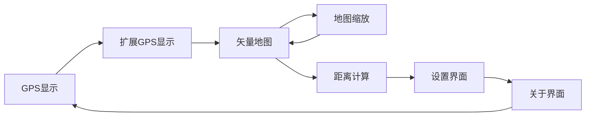

# ESP32-Powered Handheld GPS Unit 🌐

在Hackaday.io上关注本项目开发：[PocketNav32](https://hackaday.io/project/199321-pocketnav-32) 📸  
---

本项目使用ESP32微控制器处理GPS数据并在OLED屏幕上显示，创建了一个简易可扩展平台。

### 当前功能：
- 实时获取并显示经纬度（含水平精度）、海拔高度及使用的卫星数量
- 计算用户自定义两坐标点之间的距离（米）
- 显示带陆地/水域特征的矢量地图
- 菜单驱动界面支持调整显示和设备设置

## 硬件需求

- ESP32开发板
  - 可用ESP8266替代（需重新分配UART RX引脚）
- GPS模块（兼容UART）
    - 使用型号：GT U7M模块
- SSD1306 OLED显示屏
    - 兼容I2C协议的显示屏均可使用
- 设置坐标点和切换模式的按钮
- 状态指示灯LED
- 工具：用于烧录代码的 `mpfshell` 或 `make`
- 保持微笑 :)

## 引脚配置
| 组件               | 引脚号       |
|--------------------|------------|
| **GPS模块**        | RX: 16     |
| **OLED显示屏**     | SCL: 22, SDA: 21 |
| **设置按钮**       | 13         |
| **模式按钮**       | 14         |
| **显示切换按钮**   | 33         |
| **导航按钮**       | 32         |
| **模式LED**        | 12         |
| **成功LED**        | 26         |
| **错误LED**        | 27         |
| **警告LED**        | 25         |
| **GPS秒脉冲(PPS)** | 4          |

## 安装与使用

1. **硬件连接**：按引脚配置表连接组件
2. **代码部署**：
    * 将 `src/` 目录所有文件上传至运行[MicroPython](https://docs.micropython.org/en/latest/esp32/tutorial/intro.html)的ESP32根目录
    * 可选：使用Makefile通过 `make flash` 命令上传文件

3. **地图数据**：
   - 将GeoJSON地图文件上传至ESP32闪存根目录
   - 确保文件名匹配 `simplified_out_0229.geojson`（在 `src/handlers/display_handler.py` 中硬编码）

1. 启动设备
2. 喝杯水保持水分 :)
3. 设备默认进入GPS显示模式，展示实时数据
4. **操作指南**：
    * 按重置/模式按钮切换至矢量地图/距离计算/设置/关于界面
    * 距离模式下：按设置按钮标记点A，再次按标记点B
        * 设备将显示两点间计算距离
    * 矢量地图模式：按导航按钮缩放地图

## 菜单系统
菜单包含以下界面：

注意事项
GPS模块在开阔天空环境下效果最佳。建议在户外使用以获得最优效果！

开发路线
地图渲染优化：增强矢量地图显示，支持更大尺寸地图
电池优化：改进电源管理延长续航
电子墨水屏应用
新增传感器：集成指南针/气压计等增强功能
导航功能：增加航点保存和路线记录
3D打印外壳设计
PCB电路板设计
欢迎针对上述任何功能提交PR，或提出改进建议！

元件采购渠道
注： 链接仅供参考，请支持您喜爱的电子零售商

组件	描述	购买链接
ESP32开发板	ESP32S模块(ESP32-WROOM-32系列)	速卖通
GPS模块(GT U7M)	UART兼容GPS模块	速卖通
SSD1306 OLED屏	128x64 I2C OLED显示屏	速卖通
面包板	电路原型搭建	速卖通
按键开关	输入按钮	速卖通
状态LED	状态指示灯	速卖通
电阻和杜邦线	连接元件	速卖通
永恒的快乐	与地球和谐共处	无价
预估成本：25加元

贡献指南
参与方式：

Fork仓库并创建特性分支
遵循PEP 8 Python编码规范
提交包含变更说明的Pull Request
常见问题
能否使用其他GPS模块？ 可以，需确保支持UART
若未使用PPS引脚，需调整 src/handlers/gps_handler.py 中的PPS处理方法
支持ESP32-S1/2/3吗？ 支持，需按需修改引脚映射
能否增加按钮/LED？ 更新 src/handlers/button_handler.py 和 src/handlers/led_handler.py 中的配置即可
支持哪些MicroPython版本？ 已测试版本：1.23, 1.24, v1.25.0-preview.72.g2e796d6c3 (2024-11-30)
截图
操作图片和视频请见Hackaday.io页面：PocketNav32

许可证
本项目采用GNU通用公共许可证v3.0（GPLv3），详见 LICENSE 文件。
使用的MicroPython项目 ssd1306.py 驱动程序基于MIT许可证，详见 LICENSE-MIT
